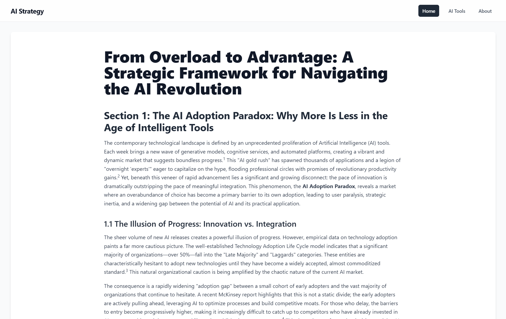

<div align="center">

</div>

# just_a_blog — AI Tools Showcase

This repository contains a small Vite/React site built as an academic project for the Semester 7 course "Cloud Computing and Data Analytics". The goal was to build a lightweight site that demonstrates AI tooling and host it on Google Cloud Platform so it is globally accessible.

Live (deployed on GCP App Engine):

https://aitoolsframwork.de.r.appspot.com/

## What this repo includes

- Source for a small frontend app (Vite + React / TypeScript) in `frontend/`.
- Docker/Caddy deployment files for the static SPA.

## Quick local run (development)

Prerequisites:

- Node.js (LTS recommended)
- npm (or pnpm/yarn)

Steps:

1. Enter the frontend directory and install dependencies

```powershell
cd frontend
npm install
```

2. Provide your Gemini API key (used by the app if applicable)

- Option A — create `.env.local` in `frontend/` and add:

```
GEMINI_API_KEY=your_gemini_api_key_here
```

- Option B — set the environment variable in PowerShell (temporary for the session):

```powershell
$Env:GEMINI_API_KEY = 'your_gemini_api_key_here'
npm run dev
```

3. Start the dev server

```powershell
npm run dev
```

Visit the local address printed by Vite (usually http://localhost:5173).

To run the production container locally without colliding with another app on
host port 8000:

```powershell
docker compose up --build -d
```

Open http://localhost:8001/just-a-blog/.

## Build for production

```powershell
cd frontend
npm run build
```

You can preview the production build locally with:

```powershell
cd frontend
npm run preview
```

## Deployment

The supported deployment artifact is the multi-stage Docker image served by
Caddy on container port 8000. Dokploy/Traefik should route `/just-a-blog/` to
that port with path stripping disabled.

The former App Engine files are retained in `docs/archive/` for reference and
are not part of the active build.

## Academic context / Attribution

This repository and the deployed site were created as part of coursework for the Semester 7 subject "Cloud Computing and Data Analytics". The project demonstrates deploying a small frontend app to GCP App Engine with an AI-focused demo surface.

If you use this code or adapt it for coursework, please include appropriate attribution.

## Troubleshooting

- Legacy App Engine files are retained under `docs/archive/`; the supported deployment path is the Docker/Caddy setup.
- Ensure required environment variables (like `GEMINI_API_KEY`) are available to the app in production.

## Contact

For questions about this academic project, contact the repository owner.

---
